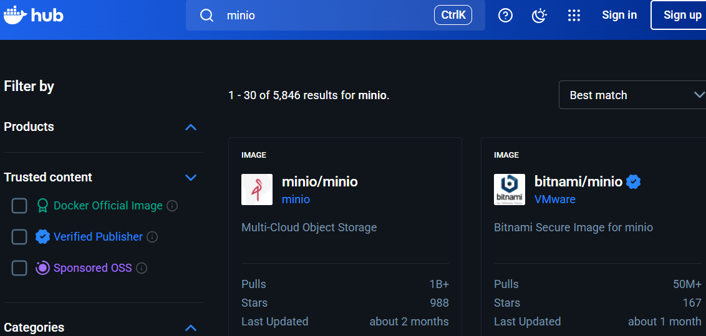
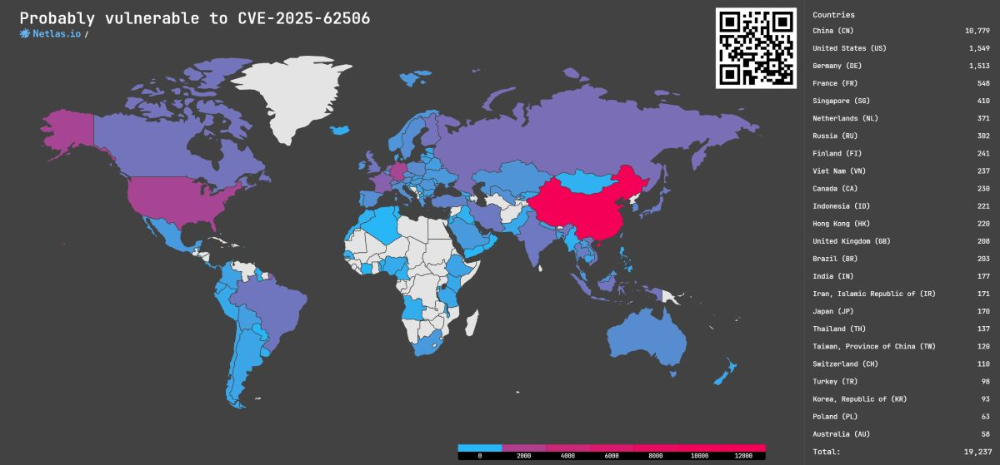

MinIO, a popular open-source object storage solution, has shifted its community edition to a "source-only" distribution as of October 2025.

<!-- more -->

This change, first mentioned in [GitHub issue #21647](https://github.com/minio/minio/issues/21647#issuecomment-3418675115), means no more pre-built Docker images or binaries from official repositories, impacting users relying on automated updates.

The decision coincided with a critical security release (`RELEASE.2025-10-15T17-29-55Z`) fixing **CVE-2025-62506** (CVSS 8.1: Privilege escalation via session policy bypass), leaving legacy images vulnerable.

In this post, we'll explore what this shift means for individuals, communities, and enterprises running MinIO in containers and where to go next.

## About MinIO

MinIO is a high-performance, distributed object storage system designed for unstructured data like photos, videos, logs, backups, and container/VM images.
Released under the GNU AGPLv3 license, it's fully compatible with the Amazon S3 API, making it a drop-in replacement for AWS S3 in private clouds, Kubernetes clusters, or edge deployments.

Founded in 2014 by Anand Babu Periasamy, Garima Kapoor, and Harshavardhana, [MinIO, Inc.](https://www.min.io/about) remains privately held, valued at $1B, with $126M in funding across three rounds [^1]:

- $3M seed in 2015 (led by AME Cloud Ventures)
- $20M Series A in 2017 (led by General Catalyst, Nexus Venture Partners, Dell Technologies Capital)
- $103M Series B in 2022 (led by Intel Capital)

The [open-source project](https://github.com/minio/minio), boasts over 58K GitHub stars and is utilized by key applications like GitLab (for object storage in Helm charts).

## Current Situation

The latest official MinIO image is outdated, harboring CVE-2025-62506, where restricted accounts can spawn unrestricted ones, risking unauthorized data access. Customers get binaries through AIStor, but the community must build manually.

This screenshot from Docker Hub (October 26, 2025) displays the two only options users had until last Summer:

- The previously-official `minio/minio` image (over 1 billion pulls), with the last push made approximately two months ago
- The now-deleted `bitnami/minio` alternative (50M+ pulls)

## Available distributions for the community

For pre-built images, community options include:

Image                                                                                      | Provider                                  | Pros                                      | Cons
-------------------------------------------------------------------------------------------|-------------------------------------------|-------------------------------------------|-------------------------------------------------
[`cgr.dev/chainguard/minio`](https://images.chainguard.dev/directory/image/minio/versions) | [Chainguard](https://www.chainguard.dev/) | 🟢 0 CVE  🟢 Small size (58 MB)        | 🔴 Only latest
[`docker.io/elestio/minio`](https://hub.docker.com/r/elestio/minio)                        | [elestio](https://elest.io/)              | 🟢 Small size (60 MB)                     | 🔴 Only latest 🔴 1 HIGH CVE (CVE-2025-62506)
[`docker.io/elasticio/minio`](https://hub.docker.com/r/elasticio/minio)                    | [elastic.io](https://www.elastic.io/)     | 🟢 Many versions 🟢 Small size (60 MB) | 🔴 1 HIGH CVE (CVE-2025-62506)

> **Why avoid `:latest` in Enterprises/Production?**  
>
> The `:latest` tag is a significant red flag for production environments because it points to the most recent image build, which may include untested updates, breaking changes, or unpatched vulnerabilities during rollout.
>
> Without version pinning, automatic updates risk downtime, data corruption, or security gaps, violating enterprise SLAs, compliance requirements (e.g., ISO 27001, PCI DSS), and best practices for reproducible deployments.
>
> Specific tags are essential for controlled, auditable updates.

**Notes**:

- Image scans were conducted using Trivy.

## Alternatives for Enterprises

Enterprises can rely on the following providers offering supported MinIO distributions:

- [Chainguard Containers](https://images.chainguard.dev/directory/image/minio/overview)
- [RapidFort Curated Images](https://www.rapidfort.com/) [^2]
- [SUSE Application Collection](https://apps.rancher.io/applications/minio)

The following options were excluded from consideration due to insufficient information or lack of access:

- [Broadcom VMware Bitnami Secure Images](https://app-catalog.vmware.com/bitnami/apps) does not list MinIO in its catalog
- [Docker Hardened Images](https://www.docker.com/products/hardened-images/) may offer it, but I am awaiting access
- [IBM Red Hat Ecosystem Catalog](https://catalog.redhat.com/en/software/container-stacks/detail/60945b58d3f6d18cdbac26fe) may be limited to OpenShift (I lack access and cannot test it)
- [Minimus](https://www.minimus.io/get-started) appears to offer MinIO, but I have not received a response to my request to get started

## Other Projects

Based on S3 compatibility, you may consider:

- [Ceph](https://ceph.io/): A robust, distributed storage system with S3 compatibility via RADOS Gateway. Backed by the Ceph community and Red Hat, it scales to exabytes.
- [S3GW](https://s3gw.tech/): A lightweight S3 gateway using PVCs (e.g., Longhorn), with Helm charts and UI. Ceph RGW-derived, ideal for backups.
- [RustFS](https://rustfs.com/): Emerging Rust-based S3-compatible storage, praised for stability despite development warnings.
- [SeaweedFS](https://github.com/seaweedfs/seaweedfs): High-performance distributed storage with S3 API support.

## Conclusion

The next steps depend heavily on the context:

- For **community** or **non-production** use, Chainguard offers the easiest security solution, but it should not be used in production due to the complexity of managing an environment with the `:latest` version. Building your own image is also an option.
- For **enterprises** or **production** environments, consider enterprise offerings, which may provide additional valuable features, such as RapidFort's container hardening.
- For **architects**, consider replacing MinIO with an alternative component, reinforcing the importance of avoiding vendor lock-in when designing systems.

This may also present an interesting opportunity to evaluate how your organization manages its supply chain, assesses its container security posture, and addresses the risks of relying directly on open-source artifacts.
There is real value in paying for services from secured application providers.

I'd be eager to hear your thoughts!
Please feel free to [contact me](/contact).

## Appendix - World map

[Netlas](https://netlas.io/) created a search on CVE-2025-62506 [^3]:

## References

[^1]: [Tracxn - MinIO's Funding Rounds](https://tracxn.com/d/companies/minio/__Srk8fHV452zPtlVbyBjR7418hkgzEa_bU0LJUHGk8IU/funding-and-investors).
[^2]: RapidFort confirmed MinIO availability across all image flavors, even if not listed on their website.
[^3]: [Netlas - Post about CVE-2025-62506](https://x.com/Netlas_io/status/1980236823491137733).

<!--
alias trivy="docker run -it --rm -v trivy-cache:/root/.cache/ -v /var/run/docker.sock:/var/run/docker.sock:ro -v $HOME/.kube/config:/root/.kube/config aquasec/trivy:latest"
trivy image docker.io/elasticio/minio:25.43
-->
